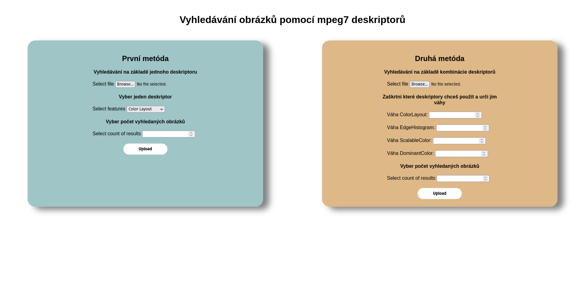

## VMM - Image similarity using MPEG7 descriptors

An Spring Boot app with Thymeleaf frontend.
Includes extended [LIRE library](https://github.com/sotnak/vmm-lire).

Before starting the application make sure, that ./lib/ is added as local library folder.
Starting the app may take a while, because indexes are created each time.
After the application starts frontend is accessible on port [8080](http://localhost:8080/).

